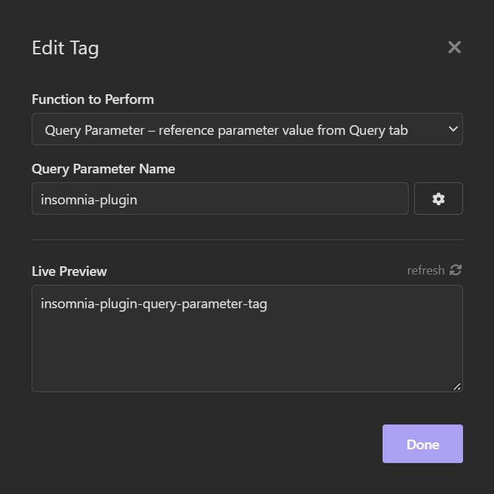

> An **[Insomnia]** plugin based on the *request built-in plugin* to allow you to use the query parameter value from the Query tab as a tag.

#  Query Parameter Tag

<!-- FIXME show NPM Badge when plugin url is available -->

<!-- FIXME show Github Start Badge when repository public is available -->
<!--  -->

<!-- FIXME show Install methods when plugin url is available -->
## Install

<!--   -->

+ In **[Insomnia]** app
+ Go to `Application` > `Preferences` > `Plugins`
+ Type `insomnia-plugin-query-parameter-tag` on input field
+ Click on `Install Plugin`. 

## Usage
+ **Add parameters first**
    - In the `Query tab`
    - Add the parameter *names* and *values*
    - *\(Optional)* Uncheck `Enable item` on each
> 
+ **Using the tag**
    - Press `Ctrl + Space` to insert `Query Parameter`
    - or type `` and click on tag
    - Type *PARAMETER_NAME* on input field `Query Parameter Name`
> 
+ **Using the tag (short method)**
    - Type ``

## Screenshot

[Insomnia]: https://insomnia.rest